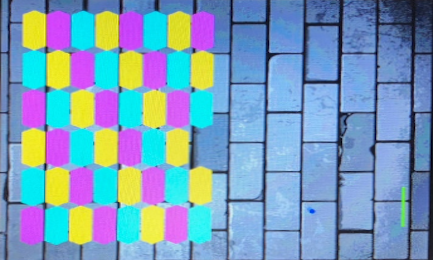

# Breakout

This is a Verilog breakout game.

The project can be built in either Xilinx ISE or Vivado.

`*.v`: verilog source files

`Top.bit`: output binary file

`image.coe`: background image

`k.xdc`: Vivado constraint file

## Demo

Press `SPACE` to start the game.

Use `←` `→` to move.
